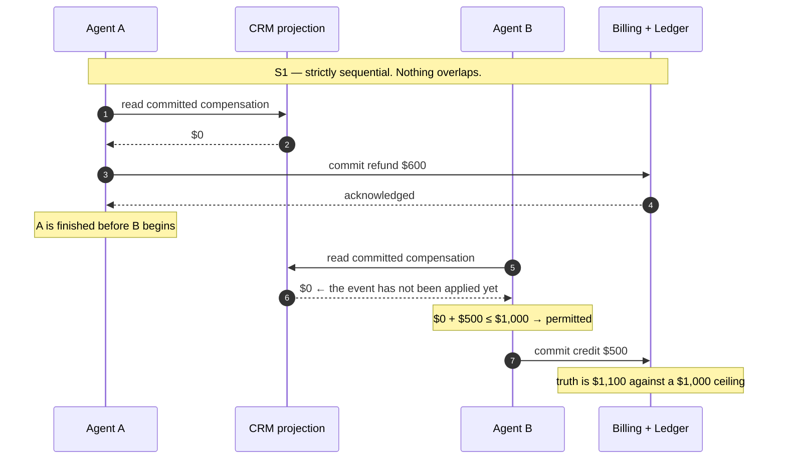
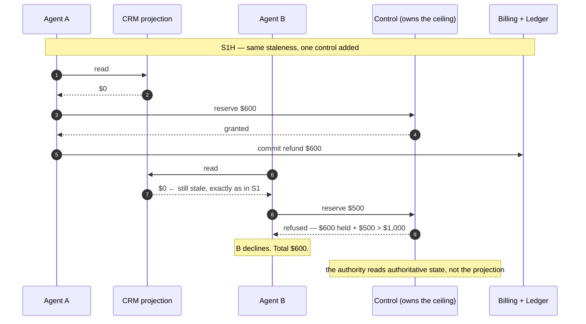

# Deep dive — 20 minutes

`DEMO.md` shows the failure. This defends it.

Audience: engineers and architects who will try to break the argument, which is
the correct response. The structure anticipates the objections in the order they
actually arrive.

Section timings are speaking time. Every claim names the artifact that backs it.

---

## 1 · The question (2 min)

Not "are agents safe." That question has no answer.

**Can an agent that does everything right still leave the business wrong?**

Precisely: every action authenticated, every action authorized, retries
idempotent, no component failing, telemetry working — and the business in a state
nobody authorized.

If the answer is no, agent reliability reduces to ordinary software quality and
you already know how to do that. If yes, there is a category of control most
systems do not have, and no amount of the existing kind substitutes for it.

The answer is yes, and it is reproducible on a laptop in fifteen seconds.

---

## 2 · Why this is not the bug you are thinking of (4 min)

Invariants are not one thing. `INVARIANT-CATALOG.md` splits them five ways, and
the split determines where enforcement can physically live.

| Class | Example | Where it can be enforced |
|---|---|---|
| **Local** | a refund is non-negative | a database constraint |
| **Cross-service** | refunds + credits ≤ ceiling | nothing that exists by default |
| **Eventual** | projection converges to truth | a reconciler, after the fact |
| **Hard** | no cross-tenant action | a deny, never a score |
| **Bounded-time** | approval valid 24h | requires a clock and an owner |

Most invariants are local, and a local invariant belongs in a `CHECK` constraint.
That is why this rarely bites: **the common case is genuinely handled.**

The second row is the problem, and it is structural. A `CHECK` constraint cannot
read another database. A service can enforce every rule it owns and cannot
enforce a sum whose terms it cannot see.

> **The load-bearing sentence:** per-action authorization and aggregate
> correctness are different properties. Systems routinely have the first and
> almost never have the second, and the first passing is what makes the second's
> absence invisible.

`S6` is the demonstration — both actors attempt, both are refused, nothing
written. Authorization is real and works. It is simply not scoped to the
aggregate.

---

## 3 · Why you should believe the instrument (5 min)

This is the section that decides whether the results mean anything, so it comes
before the results.

**The oracle proves itself before it judges.** `make calibrate` plants a
violation and requires the oracle to catch it, plants a safe state and requires
it to pass, plants a voided row and requires it to be excluded. It runs before
every schedule. An oracle never shown to catch a planted violation is unproven
instrumentation.

**The oracle cannot share a bug with the system.** It writes its own SQL, imports
no service code — checked by AST, not convention — and connects with credentials
that cannot write. A defect present in both system and judge cancels out silently,
which is the one failure mode a judge must not have.

**Execution is scripted, not observed.** A barrier coordinator gates named
checkpoints inside handlers, keyed on
`(schedule, actor, checkpoint, occurrence)`, with the occurrence assigned
server-side. It fails closed: no error path returns a release. Replays produce an
identical transition sequence.

**The negative controls are the point.** `P1`, `S1C`, `S4`, `S5`, `S6` must come
back CLEAN. A harness that only produces violations proves nothing about
anything.

**And a violation is void if the schedule did not run.** `assert_schedule_executed`
exists because five of six `P2` tests once passed with the barrier bypassed — the
interleaving happened to occur anyway. A green test is not evidence that the
scripted execution produced the result.

**Where determinism stops.** The schedule controls application checkpoints, not
Postgres locks or kernel scheduling. `ADR-007` records a replay divergence
observed once, never reproduced. A candidate cause was found, tested, and the
test **failed to reproduce it**. It remains open. That is stated here rather than
in an appendix, because an instrument whose limits are hidden is not an
instrument.

---

## 4 · The results (5 min)

**Concurrency, the version everyone expects.** `P2`: two agents read, both
correctly conclude their action fits under $1,000, both commit. Total $1,100.

**Now remove the concurrency.** `S1`: strictly sequential. Agent B begins reading
*after* A committed and was acknowledged. Still $1,100 — because B read a
projection that had not applied A's event.

> This is the pivot. Serialising the agents does not fix it. Anyone who came in
> thinking "race condition" has to revise here.

The same schedule with a coordination authority, and **the projection left exactly
as stale**:

**The stale read still happened.** It simply stopped being able to cause harm —
which is why the fault is in the interface the agent was given, not in the agent.

**Isolate the variable.** `S1C` is identical with the projection caught up →
CLEAN. So it is not the agent, not the ordering, not the amounts. It is whether
the read model was current.

**Then close the freshness escape.** `S3`: the projection *partially* catches up,
the third actor sees a **more current** view, and the aggregate still breaks.
Freshness narrows the window. It cannot close one that stays open until a write
lands elsewhere.

**What actually works.** `P0` is `P2`'s interleaving plus a reservation → CLEAN.
`S1H` is `S1`'s staleness plus a reservation → CLEAN, and it asserts B's view was
*exactly as stale as in S1*. Two pairs, one variable each, outcome flips.

**How often.** `MODE-B.md` — do not quote one number. At 0–75 ms arrival
separation, 100% violations. At 100 ms, 20%. At 125 ms and beyond, 0%. The cliff
is the agent's own read-check-write duration. And at 100 ms the race window was
open in 100% of runs while only 20% violated, which is why the window observable
exists: an open window is necessary, not sufficient. Without it, "0% at 125 ms"
and "0% at 500 ms" look identical, and only one of them is reassuring.

---

## 5 · Why nobody would have caught it (3 min)

Three independent signals, all green, simultaneously:

1. **Task success** — every agent completed its task and reported success.
2. **Distributed tracing** — one trace, `agent → crm → ledger`, every span OK, no
   error, no retry, no anomalous latency. Verified against a real collector, not
   an in-memory exporter.
3. **Reconciliation** — no lag, no drift, no duplicate keys, no orphans.

None of them is broken. Each is answering a question, correctly, and **none of
them is being asked whether the business state is right.**

> A system with excellent observability and no invariant checker cannot detect
> this class. That is measured here, not asserted — see `READINESS-MODEL.md`
> domain 7.

A confession that belongs in this section: this repository claimed working
distributed tracing while **nothing in the services ever created a span.** The
library was tested; the system was uninstrumented; nine green tests covered the
component and the property they implied about the whole was absent. It is written
up in `OBSERVABILITY.md`. It is the same defect class as the finding — which is
the most honest evidence available that this failure mode is easy to ship.

---

## 6 · What the fix costs (2 min)

An authority that can see **all of an invariant's inputs at decision time.**
Authority granted *before* the action, not validated after — validating after
detects a breach that already happened. The check and the grant atomic, or the
coordination service contains the very race it exists to prevent.

Cost, stated as a cost: a serialisation point, and latency linear in per-case
contention. `CAPACITY.md` measures it — exactly ten grants and exactly $1,000.00
at 10, 50 and 100 concurrent agents, p50 rising 381 ms → 1,654 ms → 3,262 ms.
Contention is per case; a hundred agents on a hundred invoices do not queue.

**And when you do not need one:** most invariants are local. A coordination
authority bought for a local invariant is a serialisation point bought for
nothing. Step one is not buying anything — it is classifying your invariants and
asking which system could enforce each. That step is free and frequently ends the
conversation.

---

## 7 · Does this happen outside a lab (2 min)

`PRIOR-INCIDENTS.md`, four sources read directly.

**ACIDRain** (SIGMOD 2017): 12 eCommerce platforms across 2M+ sites, 22 verified
attacks over-spending gift cards and corrupting inventory. The important clause:
17 of 22 manifest **even under the strongest transactional guarantees those
databases offer**, because the defect is where the boundary was drawn.

**Twilio, 2013**, in their own postmortem: each recharge was a valid response to
the state the biller could see and wrong against the separate datastore holding
actual account status. 1.4% of customers charged repeatedly. Found by customers,
not by monitoring.

**Now the part that must not be skipped.** None of these is this lab's exact
claim. ACIDRain's applications share one database, so a correct transaction
exists in principle. Twilio's view was wrong through data loss, not lag.

> The harm is documented. The mechanisms differ. What is absent publicly is an
> instance where **no single transaction could have enforced the invariant** —
> which is what this lab constructs deterministically, because finding it in the
> wild requires access to systems that do not publish their postmortems.

Say that plainly. An audience that catches you overreaching on evidence stops
believing the parts that are solid.

---

## 8 · What this does not claim (2 min)

- **No LLM is in the tested path**, deliberately. A deterministic agent means no
  failure can be blamed on a hallucination or a prompt. It is *stronger* evidence
  for the structural claim, and it means this says nothing about model behaviour.
- **Not a production frequency.** One machine, local services, no network
  latency. Mode B describes one workload.
- **`ADR-007` is open.** A divergence seen once, a candidate cause found and then
  refuted by its own test.
- **Replay inside a token's validity window is not prevented** — there is no
  `jti` ledger. Named in `THREAT-MODEL.md` rather than implied away.

---

## The hard questions

| Question | Answer |
|---|---|
| "Just use one database." | Correct for two services, and it is the right answer when available. It does not survive the third team, the acquisition, or the SaaS vendor. ADR-009 explains why separate databases are the premise: merge them and there is nothing to study. |
| "Use a distributed transaction / saga." | A saga gives you compensation, not prevention — it unwinds after the fact. That is a business decision (is a reversed refund acceptable?), not a technical equivalence. |
| "Serializable isolation." | ACIDRain: 17 of 22 vulnerabilities survive it. Isolation governs one database; this spans two. |
| "Make the agent re-read before writing." | `S3`. The window narrows and does not close. |
| "This is just TOCTOU." | `P2` is. `S1` is not — nothing overlaps. That is why both exist. |
| "Your agent is a strawman." | ADR-014, plus the negative controls that pass. `S6` refuses both actors and writes nothing. |
| "Why should I trust the oracle?" | `make calibrate`, before every schedule. And it imports no service code, enforced by AST. |
| "Isn't the reservation just a lock?" | Yes. The contribution is not the mechanism, it is knowing *which* invariants need one — which is the classification step, and the part no tool does for you. |

## Closing

> Nothing here was a bug. No component failed. Every control did exactly what it
> was built for, at the scope it was built for.
>
> The invariant spanned two services, and no authority owned it.
>
> The first step costs nothing: write your invariants down, classify them, and
> for each one ask which system could actually enforce it. Most are local. The
> ones that are not usually have no owner — and that is the finding, in your
> system rather than mine.
